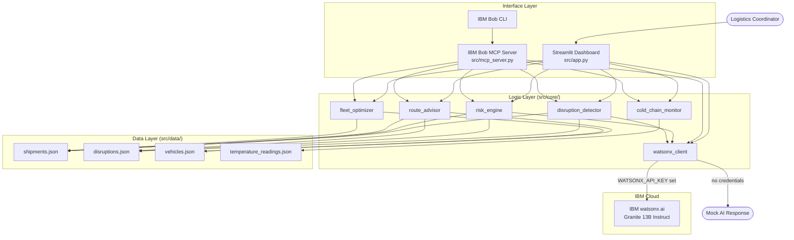

# Architecture

## System Diagram

## Component Table

| Component | File | Role |
|---|---|---|
| Streamlit Dashboard | `src/app.py` | Five-page UI — Dashboard, Shipments, Disruptions, Fleet, Cold Chain |
| IBM Bob MCP Server | `src/mcp_server.py` | 7 MCP tools for natural-language supply chain queries via IBM Bob |
| disruption_detector | `src/core/disruption_detector.py` | Matches active disruptions to shipments using 5 matching rules |
| risk_engine | `src/core/risk_engine.py` | Scores shipments 0-100 with 5-factor model; classifies CRITICAL/HIGH/MEDIUM/LOW |
| route_advisor | `src/core/route_advisor.py` | Returns pre-defined alternative routes that avoid active disruptions |
| fleet_optimizer | `src/core/fleet_optimizer.py` | Vehicle availability, utilisation metrics, and best-vehicle recommendation |
| cold_chain_monitor | `src/core/cold_chain_monitor.py` | Temperature excursion detection, severity classification, and risk scoring |
| watsonx_client | `src/core/watsonx_client.py` | IBM watsonx.ai integration with mock fallback |
| shipments.json | `src/data/shipments.json` | Master shipment records with route, carrier, origin, destination, ETA |
| disruptions.json | `src/data/disruptions.json` | Active disruption events with severity, affected ports, routes, carriers |
| vehicles.json | `src/data/vehicles.json` | Fleet vehicle records with capacity, location, cargo type support |
| temperature_readings.json | `src/data/temperature_readings.json` | IoT sensor temperature logs per cold-chain shipment |

## Data Flow

1. The user opens the Streamlit dashboard and selects a page.
2. `app.py` calls `@st.cache_data`-decorated helpers that invoke the core modules.
3. `disruption_detector` loads `shipments.json` and `disruptions.json`, applies five matching rules, and returns which disruptions affect each shipment.
4. `risk_engine` calls `disruption_detector` for disruption severity, reads ETA and delay from `shipments.json`, and computes a 0-100 score with a breakdown by factor.
5. `route_advisor` loads the ROUTE_ALTERNATIVES knowledge base, filters alternatives by cargo type and disruption avoidance, and enriches each option with available vehicles from `vehicles.json`.
6. `fleet_optimizer` reads `vehicles.json` and `shipments.json` to determine assigned/idle status and returns TEU-sorted vehicle lists and utilisation metrics.
7. `cold_chain_monitor` reads `temperature_readings.json`, analyses each reading against the shipment's safe range, and classifies excursion severity.
8. When the user clicks "Generate AI Explanation", `watsonx_client` builds a structured prompt and calls IBM watsonx.ai, or returns a mock response if credentials are absent.
9. All results are rendered on-screen with colour-coded badges, `st.metric` KPI cards, and `st.line_chart` for temperature history.

## IBM Technology Integration

### IBM watsonx.ai

- **SDK:** `ibm-watsonx-ai` (Python)
- **Model:** `ibm/granite-13b-instruct-v2` (configurable via `WATSONX_MODEL_ID`)
- **Authentication:** IBM Cloud API key + project ID via environment variables
- **Prompt design:** Supply chain-specific prompts built from live risk data (shipment ID, score, disruption titles)
- **Fallback:** If credentials are absent or the SDK is not installed, a clearly labelled `[Demo Mode - Mock AI]` response is returned

### IBM Bob MCP Server

- **Protocol:** Model Context Protocol (MCP) over stdio
- **Tools registered:** 7 (see solution-overview.md for full list)
- **Usage:** IBM Bob calls the MCP server when a logistics coordinator asks a supply chain question in natural language
- **Configuration:** Registered in the IBM Bob MCP configuration as a local stdio server running `python mcp_server.py`

## Security Considerations

- **No hardcoded secrets** — All credentials (API key, project ID) are read from environment variables only
- **`.env` in `.gitignore`** — The `.env` file is excluded from version control; only `.env.example` (with placeholder values) is committed
- **No external network calls at import** — All modules import cleanly without making network requests; watsonx is only called when the user explicitly clicks "Generate AI Explanation"
- **Read-only data access** — The application only reads JSON files; no write operations are performed

## Scalability Notes

The current implementation is a zero-dependency demo designed for rapid setup. In a production context:

- The JSON data files would be replaced with a database (PostgreSQL, IBM Db2) with connection pooling
- The `disruption_detector` matching logic would be replaced with a streaming event processor (e.g., IBM Event Streams / Kafka)
- The `watsonx_client` would use a queue to batch AI requests and avoid rate limits
- The Streamlit app would be replaced with a React or Angular frontend backed by a FastAPI service layer
- Authentication would be added using IBM App ID or an OAuth2 provider
